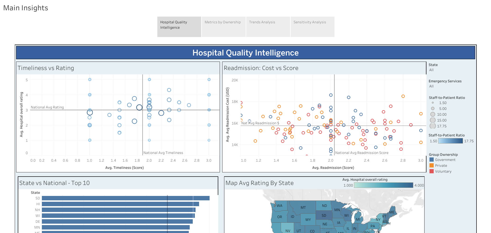
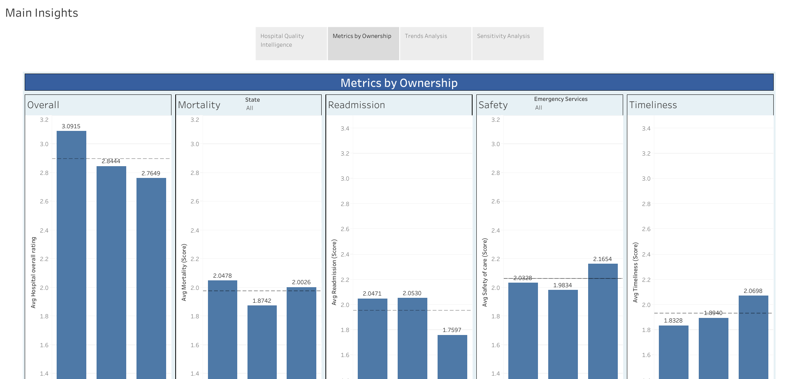
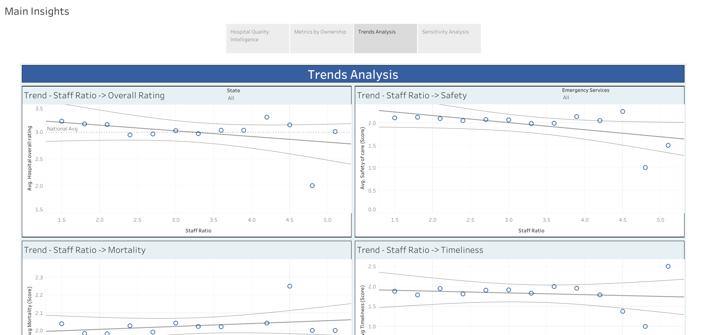
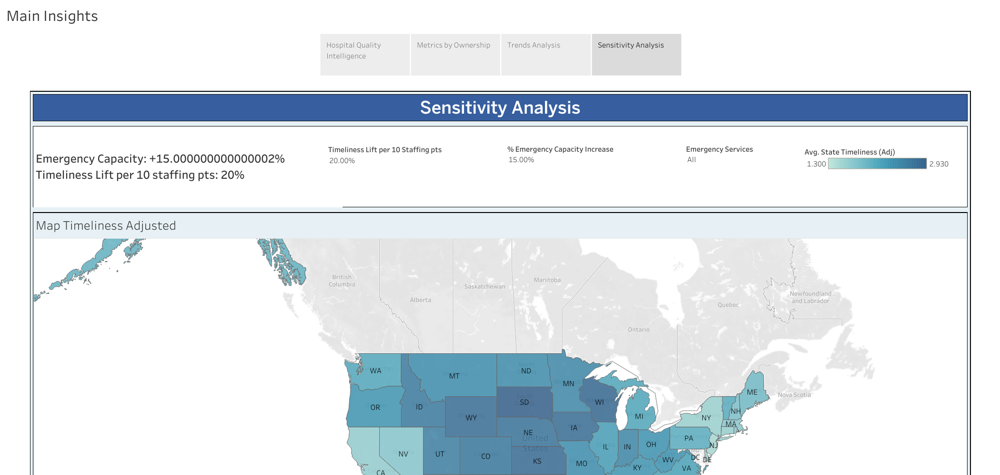

# Hospital Quality Intelligence Dashboard  
*Interactive Tableau project analyzing U.S. hospital performance through advanced data visualization and analytics.*

---

## Overview  

This project presents an **executive-ready Tableau dashboard** that evaluates hospital performance across the United States using data from the **Centers for Medicare & Medicaid Services (CMS)**.  
It demonstrates advanced **data visualization, ETL, and analytical storytelling** techniques — including **data blending, LOD expressions, forecasting, and parameter-driven sensitivity analysis** — to explore how **ownership, staffing levels, and regional factors** influence healthcare quality outcomes.  

Developed as part of the *Master of Data Analytics* program at the **University of Niagara Falls, Canada**, the project reflects the rigor and presentation standards expected in data analytics co-op roles.  

---

## 1. Objectives  

- Analyze **hospital quality indicators** by ownership type, staffing, and region.  
- Combine multiple data sources using **Tableau Prep** for ETL and data transformation.  
- Apply **LOD (Level of Detail) expressions** and **data blending** for deeper insights.  
- Develop an **interactive dashboard** for executive-level decision-making and comparison.  
- Communicate complex metrics through **clean visual storytelling and KPI design**.  

---

## 2. Data Preparation  

The dataset is derived from the **CMS Hospital General Information** database and includes two engineered variables:  
- **Staff-to-Patient Ratio**  
- **Average Readmission Cost per Provider ID**  

Data processing and ETL were performed in **Tableau Prep**:  
- Removed irrelevant and non-analytic fields  
- Standardized data types and normalized categorical values  
- Mapped text ratings to numeric scales (Overall 1–5; Quality 1–3)  
- Corrected geospatial coordinates for accurate mapping  
- Joined and exported as a `.hyper` extract for Tableau Desktop  

---

## 3. Key Insights  

- **Non-profit hospitals** outperform in overall quality and patient outcomes.  
- **Private (for-profit)** institutions excel in **Safety & Timeliness** but underperform in **Readmission rates**.  
- **Government hospitals** maintain average performance, with **Mortality** slightly below national benchmarks.  
- **Geographic location alone** does not determine quality — **management and process efficiency** are stronger drivers.  
- **Staff-to-patient ratio** has limited correlation with outcomes, highlighting the role of workflow optimization.  

---

## 4. Dashboard Features  

- Dynamic KPI panel: **State vs National comparison**  
- Ownership-based performance benchmarking  
- Interactive trend analysis (**Staff Ratio → Quality metrics**)  
- Parameter-driven **Sensitivity (What-If) Simulator**  
- Clear narrative flow: *Overview → Ownership → Trends → Sensitivity Analysis*  

---

## 5. Project Preview  

| Section | Screenshot |
|----------|-------------|
| Overview |  |
| Ownership Metrics |  |
| Trends Analysis |  |
| Sensitivity Simulator |  |

---

## 6. Technical Stack & Skills  

**Tools**  
Tableau Desktop • Tableau Prep • Excel • Python (Data Cleaning)  

**Techniques**  
ETL / Data Transformation • Data Blending • LOD Expressions • KPI Design • Forecasting • Parameterized Simulations • Storytelling with Data • Healthcare Analytics  

**Keywords**  
`ETL` · `Data Blending` · `LOD Expressions` · `Forecasting` · `Parameter Control` · `Interactive Dashboards` · `Healthcare Analytics` · `KPI Design` · `Storytelling with Data`  

---

## 7. Deliverables  

- **Interactive Dashboard (Tableau Public):** [View Here](https://public.tableau.com/app/profile/jose.ayon3486/viz/HospitalQualityDashboardU_S_HospitalPerformanceInsights/MainInsights)  
- **Full Report (PDF):** [Download Report](Hospital_Quality_Analysis_Report_JoseAyonWu.pdf)  
- **Author LinkedIn:** [Jose Ayon Wu](https://www.linkedin.com/in/joseayonwu)  

---

## 8. Author  

**José Antonio Ayón Wu**  
Master of Data Analytics — University of Niagara Falls, Canada  
📍 Ontario, Canada  
📧 [joseayonwu@gmail.com](mailto:joseayonwu@gmail.com)  
🔗 [LinkedIn](https://www.linkedin.com/in/joseayonwu) | [GitHub](https://github.com/joseayonwu)

---

## 9. License  

Released under the [MIT License](https://opensource.org/licenses/MIT).  
© 2025 Jose Ayon Wu | Data Analytics Portfolio  

---

*Disclaimer: This project is for educational and analytical demonstration purposes only. The data and interpretations are illustrative and do not represent real hospital outcomes.*
